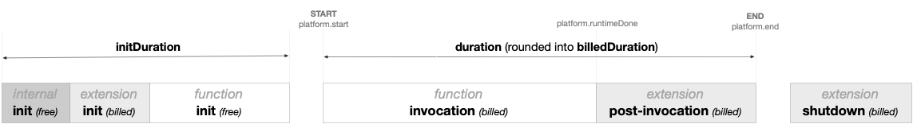

<!--
title: Duration
menuText: Duration
description: Details about the durations shown in the Console UI 
menuOrder: 8
-->

# Duration
The term duration is used in a variety of scenario and charts
within Serverless Console. 

This documentation helps provide a glossary of terms of the [AWS Lambda execution environment](https://docs.aws.amazon.com/lambda/latest/dg/lambda-runtime-environment.html), 
and explains what is included, or excluded when looking at duration
values in Serverless Console charts and interfaces.

## Initialization
Function initialization is a set of processes that happens before a Lambda Function is ready to be executed. 

* Extension Init – Initializing all External AWS Lambda Extensions configured on the function (there is a limit of 10 Extensions per function).

* Runtime Init – Initializing the AWS Lambda Runtime (e.g, Node.js, Python).

* Function Init – Initializing the AWS Lambda Function code.

Initialization only appears for the first event processed by each instance of your function, which is also known as a [Cold Start](#cold-start). It can also appear in advance of function invocations if you have enabled provisioned concurrency.You will want to [optimize Initialization performance](#optimizing-initialization-in-aws-lambda) as best you can. Poor Initialization performance will directly affect the experience of your users and customers.

### Cold Start
When an AWS Lambda function receives a request, and it has not been used before, or for several minutes, its environment and code must first be Initialized.  This process is known as an AWS Lambda Cold-Start.  This process adds latency to the overall invocation duration.

After the execution completes, the execution environment is frozen. To improve resource management and performance, the Lambda service retains the execution environment for a non-deterministic period of time. During this time, if another request arrives for the same function, the service may reuse the environment. This second request typically finishes more quickly, since the execution environment already exists and it’s not necessary to download the code and run the initialization code. This is called a Warm-Start.

According to an analysis of production Lambda workloads, cold starts typically occur in under 1% of invocations. The duration of a cold start varies from under 100 ms to over 1 second

## Invocation 
Function invocation refers the set of processing process by your [handler](../glossary.md#handler) as well as any time spent processing extension behavior. 

It's important to note that your function's timeout setting limits the duration of the entire Invocation phase. For example, if you set the function timeout as 360 seconds, the function and all extensions need to complete within 360 seconds.

### Timeout
A timeout is a configurable limit for the duration of your AWS Lambda.

## Shutdown
This phase of AWS Lambda.  This phase is run when AWS Lambda is about to shut down the runtime.

## Understanding Duration Across Console
Applying these definitions, you can expect the following behavior and details
are included across Console. 

**On the Metrics View**
The red number and dots represent the slowest 5% of transactions that occurred 
during the time frame selected. This does not include Cold Starts. 

The black number and line describe the average Duration for the selected time frame. 
This does not include Cold Starts.

**On the Explorer** 

**On Trace Detail View**

## Optimizing Initialization in AWS Lambda
You will want to optimize Initialization performance as best you can. Poor Initialization performance will directly affect the experience of your users and customers. Additionally, it's important to note that AWS charges you for Initialization time. Unfortunately, no tooling can offer a breakdown of what happens within the Initialization phase of AWS Lambda. Generally, adding multiple Extensions, large code file sizes, and using a slower runtime (e.g., Java) are the biggest culprits when it comes to slow Initialization.

Once initialized, each instance of your function can process thousands of requests without performing another Initialization. However, AWS Lambda function instance containers will shutdown within 5-15 minutes of inactivity. After that, the next event will be a Cold-Start, causing Initialization to run again.

## Configuring Timeouts in AWS Lambda
It's important to note that your function's timeout setting limits the duration of the entire Invocation phase. For example, if you set the function timeout as 360 seconds, the function and all extensions need to complete within 360 seconds.

## Extensions and the Invocation Phase
Adding [Lambda Layers](../glossary.md#lambda-layer) to your function will impact
the lifecycle of you AWS function. 

* Adding the [Serverless external extension](../integrations/data-sources-and-roles.md#external-extension) by [enabling Dev Mode](../integrations/enable-monitoring-features.md#enabling-dev-mode) will not affect the performance for end users but may impact
initialization and shutdown times slightly and will impact the billed duration for that
function.

* Adding the [Serverless node SDK](../integrations/data-sources-and-roles.md#serverless-node-sdk) by
[enabling Tracing](../integrations/enable-monitoring-features.md#enabling-traces) will have a small
impact on the execution of the invocation phase of your function. This impact is hard to measure 
precisely but should only account for a few milliseconds. 
